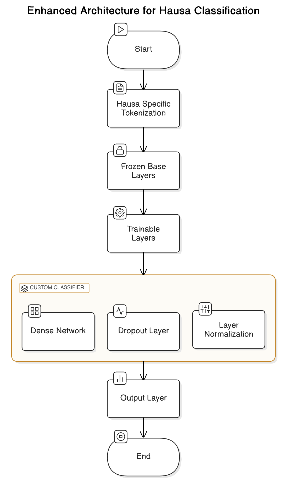
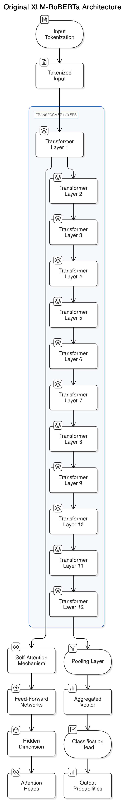

# DEPARTMENT OF COMPUTER ENGINEERING. 
AHMADU BELLO UNIVERSITY, ZARIA  
FIRST SEMESTER EXAMINATION  
2024/2025 ACADEMIC SESSION  
COEN541: Natural Language Processing  

---

## Hausa News Topic Classification Application  
**Group 10 Project Submission**  

### Group Members
| Name                          | Matric Number  | Role          |
|-------------------------------|----------------|---------------|
| Ibrahim Rabiu                 | U19CO2013      | Group Leader  |
| Ibrahim Abduljabbar Hamid     | U19CO2017      | Member        |
| Aminu Muhammad Baba           | U18CO1035      | Member        |
| Arop Dominic Arop             | U18CO1086      | Member        |
| Ya'u Musbahu Usman            | U19CO2018      | Member        |

---

## Table of Contents
1. [Problem Statement](#problem-statement)
2. [Objectives](#objectives)
3. [Dataset](#dataset)
4. [Methodology](#methodology)
5. [Implementation](#implementation)
6. [How to Run](#how-to-run)
7. [Results](#results)
8. [Challenges](#challenges)
9. [Report Structure](#report-structure)
10. [References](#references)

---

## Problem Statement
Development of a Hausa-language news topic classifier using transfer learning techniques for low-resource scenarios. The application classifies VOA Hausa news headlines into 5 categories: Nigeria, Africa, World, Health, and Politics.

---

## Objectives
1. Implement fine-tuning of pre-trained XLM-RoBERTa model
2. Address challenges in low-resource language processing
3. Develop interactive Gradio web interface
4. Achieve state-of-the-art performance on Hausa text classification
5. Demonstrate practical NLP application deployment

---

## Dataset
**hausa_voa_topics** (From Hugging Face Datasets)  
- Source: `UdS-LSV/hausa_voa_topics`
- Structure:
  - Total samples: 2,917
  - Train: 2,045 samples
  - Validation: 290 samples
  - Test: 582 samples
- Label Distribution (Training Set):
  | Label | Category | Count |
  |-------|----------|-------|
  | 4     | Politics | 563   |
  | 2     | World    | 449   |
  | 1     | Africa   | 434   |
  | 0     | Nigeria  | 315   |
  | 3     | Health   | 284   |

---

## Methodology
1. **Base Model**: XLM-RoBERTa-base (Uncased)
2. **Tokenization**:
   - Max Sequence Length: 128
   - Tokenization Speed: ~1,647 examples/sec
3. **Training Parameters**:
   - Learning Rate: 2e-5
   - Batch Size: 16
   - Epochs: 3
   - Optimizer: AdamW
4. **Evaluation Metrics**:
   - Accuracy
   - Weighted F1-Score

---

## Implementation
### Technical Stack
- Python 3.11
- Transformers 4.35.2
- PyTorch 2.1.0
- Gradio 4.12.0
- CUDA-enabled GPU (using Google COLAB)

### Key Processes
1. **Data Preparation**:
   - Automatic train/validation/test splitting (70%/10%/20%)
   - Label mapping and dataset formatting
   - Dynamic padding and truncation

2. **Model Configuration**:
   ```python
   model = AutoModelForSequenceClassification.from_pretrained(
       "xlm-roberta-base", 
       num_labels=5
   )
   ```

3. **Training Setup**:
   - Early stopping with model checkpointing
   - Epoch-based evaluation strategy
   - Logging at 10-step intervals

---

## How to Run
1. Requirements:
```bash
pip install torch transformers datasets gradio scikit-learn
```

2. Execution:
```bash
python hausa_classifier.py
```

3. Access Options:
- Local Deployment: `http://127.0.0.1:7860`
- Cloud Demo: [Live Gradio Interface](https://b2f05649db4d0bd1e4.gradio.live/)

---

## Results
### Training Progress
| Epoch | Train Loss | Val Loss | Accuracy | F1 Score |
|-------|------------|----------|----------|----------|
| 1     | 1.3245     | 1.0398   | 62.76%   | 56.66%   |
| 2     | 0.8961     | 0.7852   | 75.86%   | 75.29%   |
| 3     | 0.8174     | 0.7269   | 75.86%   | 75.54%   |

### Final Evaluation
| Metric     | Test Performance |
|------------|------------------|
| Loss       | 0.6315          |
| Accuracy   | 80.41%          |
| F1 Score   | 80.50%          |
| Inference Speed | 153 samples/sec |

---
 


---
## Challenges
1. **Hardware Limitations**:
   - Training on Dell i5 6th Gen (8GB RAM) achieved only 30% progress in 2 hours
   - Final training required GPU acceleration (CUDA-enabled device)

2. **Class Imbalance**:
   - Significant disparity in class distribution (Politics:563 vs Health:284)

3. **Model Initialization**:
   - Partial weight reinitialization warning from transformers library
   - Required careful hyperparameter tuning

---

## Report Structure (8 Slides)
1. Introduction to Low-Resource NLP
2. Dataset Characteristics & Challenges
3. Model Architecture Selection
4. Training Process & Optimization
5. Performance Evaluation
6. Comparative Analysis
7. Application Interface Showcase
8. Conclusion & Future Directions

---

## References
1. Hugging Face Transformers Documentation
2. XLM-RoBERTa: Unsupervised Cross-lingual Representation Learning at Scale
3. PyTorch Distributed Training Guide
4. Gradio Interface Best Practices
5. VOA Hausa Dataset Paper

**Submitted to:** Dr. S.M. Yusuf  
**Submission Date:** 12 March 2025  
**Contact:** smyusuf@abu.edu.ng
```

